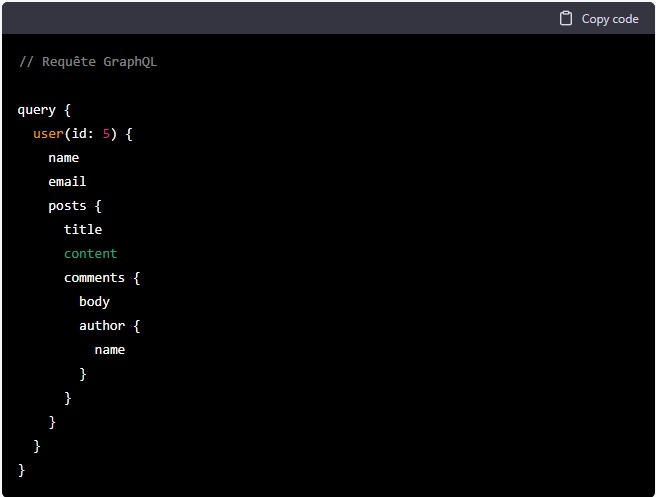
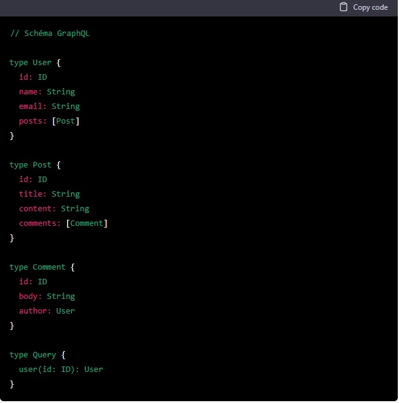

# GraphQL

GraphQL est un langage de requête et de manipulation de données pour les API, développé par Facebook en 2012. Il s'agit d'une alternative au protocole REST traditionnel, qui permet aux développeurs de définir explicitement les données dont ils ont besoin dans une requête, plutôt que de devoir faire plusieurs requêtes REST pour obtenir les données nécessaires à leur application.

GraphQL offre de nombreux avantages par rapport à REST, notamment la possibilité de faire des requêtes plus efficaces en ne récupérant que les données dont on a besoin, plutôt que d'avoir à faire des requêtes séparées pour chaque élément de données. Cela peut aider à réduire les temps de chargement des pages et améliorer l'expérience utilisateur.

En outre, GraphQL permet aux développeurs de travailler avec des données structurées de manière plus précise et de manipuler ces données de manière plus flexible. Cela peut aider à accélérer le développement d'applications et à faciliter la maintenance et l'évolution des API.

GraphQL est de plus en plus utilisé dans les applications web et mobiles modernes, en particulier pour les applications qui nécessitent un grand nombre de données ou qui doivent traiter ces données de manière complexe. En résumé, GraphQL est un outil puissant pour les développeurs souhaitant créer des API efficaces et flexibles pour leurs applications.

---

Dans cet exemple, la requête GraphQL demande des données sur un utilisateur avec un ID spécifique, ainsi que des informations sur ses publications et les commentaires associés. Le schéma définit les types de données utilisés dans la requête, notamment les types User, Post et Comment, ainsi que la façon dont ces types sont liés les uns aux autres.

Lorsque la requête est exécutée, elle récupère les données de l'utilisateur et de ses publications, ainsi que les commentaires associés à chacune de ces publications. Le résultat de la requête est retourné sous forme de données structurées, qui peuvent être utilisées directement par l'application pour afficher les informations demandées.

---

Les avantages de GraphQL par rapport aux alternatives incluent :

Flexibilité : GraphQL permet aux développeurs de définir les données dont ils ont besoin dans une requête, plutôt que d'être limités par les endpoints prédéfinis d'une API REST. Cela peut aider à améliorer l'efficacité des requêtes et à faciliter le développement d'applications qui ont besoin d'un grand nombre de données ou de traitements complexes.

Efficacité : GraphQL permet de réduire les temps de chargement des pages en ne récupérant que les données dont on a besoin, plutôt que d'avoir à faire plusieurs requêtes REST pour obtenir les différentes données nécessaires. Cela peut améliorer l'expérience utilisateur et accélérer les performances de l'application.

Evolutivité : GraphQL offre une flexibilité accrue pour évoluer les API au fil du temps, en permettant aux développeurs de changer les schémas des données sans affecter les clients existants. Cela peut aider à faciliter la maintenance et le développement continu des applications.

Cependant, GraphQL a également quelques inconvénients par rapport aux alternatives :

Apprentissage : GraphQL peut être plus difficile à apprendre pour les développeurs qui ne sont pas familiarisés avec ce type de langage de requête. Cela peut entraîner un temps d'adaptation plus long et des coûts de formation supplémentaires.

Sécurité : GraphQL peut être plus difficile à sécuriser correctement que les alternatives, en particulier si les développeurs ne prennent pas en compte les bonnes pratiques de sécurité lors de la création des schémas et des resolvers. Cela peut augmenter les risques de faille de sécurité dans les applications.

En résumé, GraphQL offre de nombreux avantages pour les applications qui ont besoin de flexibilité et d'efficacité dans la gestion des données, mais il peut présenter des challenges pour l'apprentissage et la sécurité.